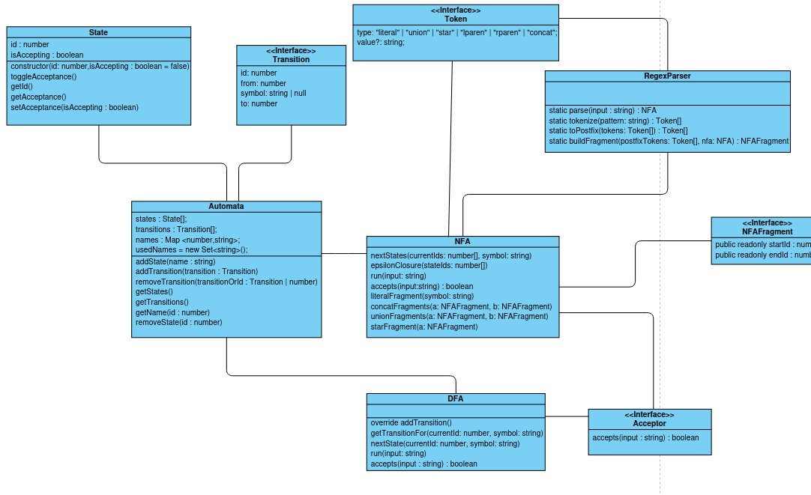

# Automata Builder

A TypeScript library for modeling and working with formal automata in a structured, extensible way. The project is currently focused on the API layer: defining the domain model, core abstractions, and automata behavior before any interface or visual builder is introduced.

## Overview

Automata Builder is intended as a reusable automata toolkit for:

- representing states and transitions
- modeling deterministic and nondeterministic automata
- managing start and accepting states
- validating input against automata logic
- supporting future extensions such as regex-derived automata and higher-level parsing workflows

This repository is designed as a library-first project. The UML below defines the architectural foundation for the implementation and remains the reference model for the API.

## UML Model

## Architectural Model

The project is organized around a small set of core abstractions designed to remain clear and extensible.

### Core entities

- State
  - Represents an individual automaton node
  - Stores the state identifier and acceptance status

- Transition
  - Represents a directed connection between two states
  - Encodes the symbol required to traverse the transition, including epsilon-like edge cases when needed

- Automata
  - Serves as the base abstraction for automata implementations
  - Maintains state and transition collections as well as naming metadata
  - Manages the start state and common mutation operations

### Specialized automata

- DFA
  - Deterministic finite automaton
  - Enforces a single valid transition per state and symbol

- NFA
  - Nondeterministic finite automaton
  - Supports multiple possible transitions and acceptance across alternate paths

### Supporting abstractions

- Token
  - Represents a lexical unit with structural metadata

- NFAFragment
  - Models a reusable automata fragment that can be composed into larger structures

- Acceptor
  - Defines the interface for accepting or rejecting input according to automata rules

- RegexParser
  - Converts textual patterns into tokens and fragments for automata construction

## Planned API Structure

The intended public API is organized around the following responsibilities:

1. State creation and configuration
   - create states
   - mark or unmark accepting states
   - retrieve state metadata

2. Transition management
   - add transitions between states
   - validate source and destination references
   - support symbol-based navigation and generalized transition behavior

3. Automata lifecycle
   - define the initial state
   - add and remove states
   - add and remove transitions
   - inspect automata state and transition collections

4. Validation and execution
   - evaluate input against automata behavior
   - determine acceptance or rejection
   - support DFA- and NFA-specific execution rules

5. Composition and parsing extensions
   - tokenize input patterns
   - build automata fragments from tokens
   - combine fragments into more advanced recognizers

## Design Principles

- Prefer explicit, typed abstractions over implicit behavior.
- Keep the base automata model independent from UI concerns.
- Maintain a clear distinction between core automata logic and higher-level parsing or visualization features.
- Use the UML as the architectural reference for the implementation, rather than introducing ad hoc structures.

## DFA execution cache note

The UML shows the conceptual DFA model, but it does not include the internal optimization used during execution.

The DFA keeps a cached transition index for fast lookup during `run()` and `accepts()` calls:

- outer key: current state id
- inner key: input symbol
- value: the matching transition

This cache is a performance shortcut, not the source of truth. It must be invalidated whenever the automaton changes because the transition table can become stale.

That means the cache should be cleared after any mutation that affects DFA behavior, including:

- adding a transition
- removing a transition
- adding a state
- removing a state
- changing the start state

The reason is simple: the cached index is derived from the current DFA structure, and a stale cache would allow `run()` to use outdated transitions even though the automaton itself has changed.

This is an implementation detail of the execution layer, so it is intentionally not shown in the UML; it exists only to make repeated lookups faster while preserving the same formal DFA behavior.

## Project Scope

This repository currently focuses on the API and domain model. The UI is not part of the immediate scope and will be considered only after the automata core is defined and stable.

## Status

- Documentation: complete
- UML-driven architecture: defined
- API foundation: in progress
- UI development: not planned yet
