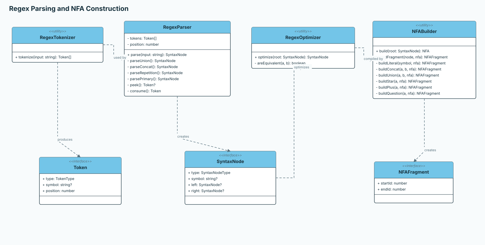
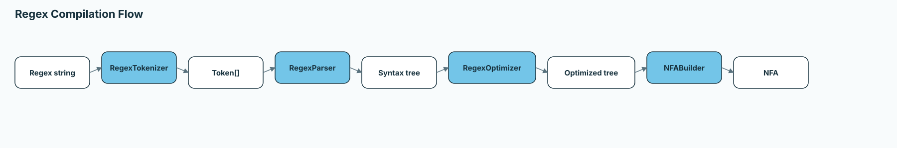
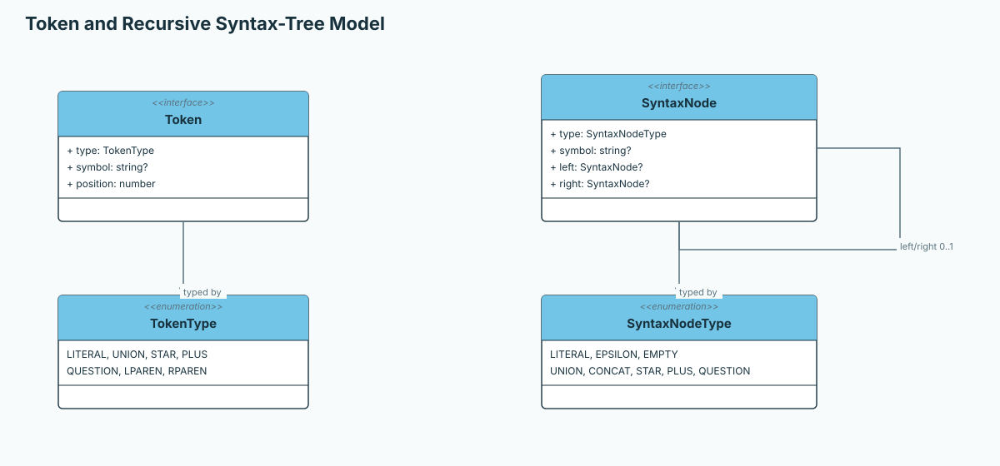
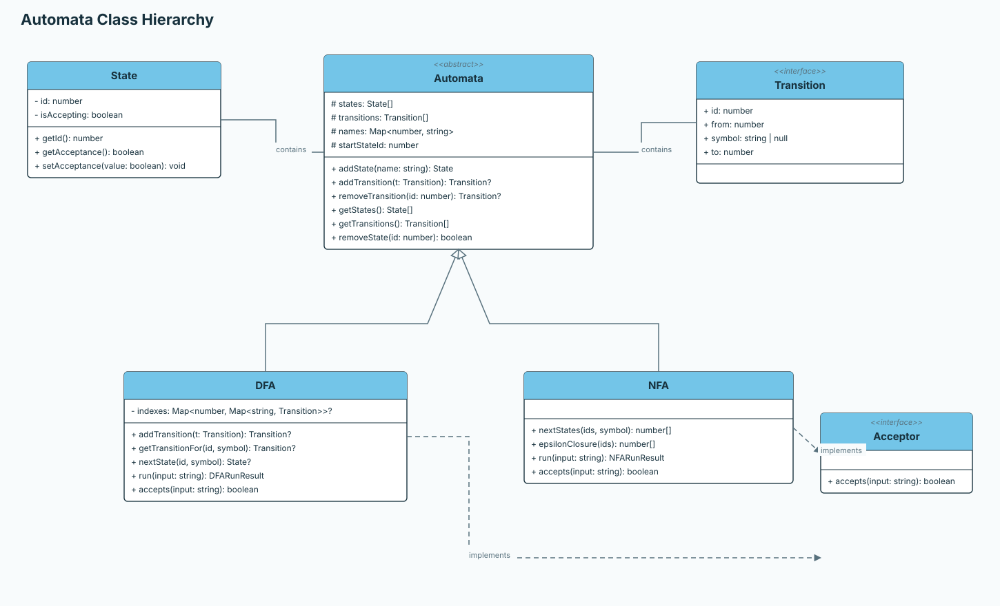
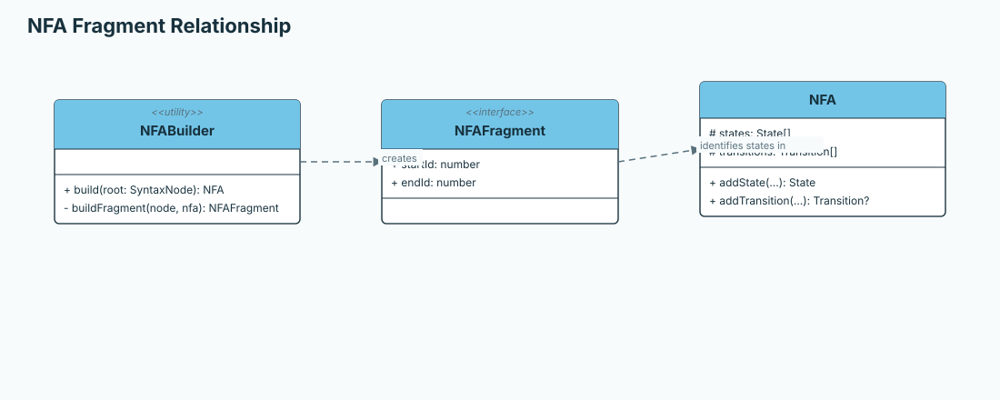

# Automata Builder

A TypeScript library for modeling and working with formal automata in a structured, extensible way. The project is currently focused on the API layer: defining the automata model and building a regex interpreter and parser that can compile expressions into NFAs.

## Overview

Automata Builder is intended as a reusable automata toolkit for:

- representing states and transitions
- modeling deterministic and nondeterministic automata
- managing start and accepting states
- validating input against automata logic
- tokenizing and parsing regular expressions
- compiling parsed regular expressions into NFAs
- supporting a future NFA-to-DFA conversion

This repository is designed as a library-first project. The diagrams below document the planned architecture and the stages of the regex compilation pipeline. They are reference models for the implementation, not a claim that every component is already available.

## Architecture Diagrams

### Regex pipeline

### Syntax tree and automata model

## Architectural Model

The project is organized around a small set of core abstractions designed to remain clear and extensible.

### Core entities

- State
  - Represents an individual automaton node
  - Stores the state identifier and acceptance status

- Transition
  - Represents a directed connection between two states
  - Encodes the symbol required to traverse the transition, including epsilon-like edge cases when needed

- Automata
  - Serves as the base abstraction for automata implementations
  - Maintains state and transition collections as well as naming metadata
  - Manages the start state and common mutation operations

### Specialized automata

- DFA
  - Deterministic finite automaton
  - Enforces a single valid transition per state and symbol

- NFA
  - Nondeterministic finite automaton
  - Supports multiple possible transitions and acceptance across alternate paths

### Supporting abstractions

- Token
  - Represents a lexical unit with structural metadata

- NFAFragment
  - Models a reusable automata fragment that can be composed into larger structures

- Acceptor
  - Defines the interface for accepting or rejecting input according to automata rules

- RegexParser
  - Will convert tokens into a syntax tree for automata construction

- SyntaxNode
  - Represents the recursive structure of a parsed regular expression

- NFAFragment
  - Represents a composable start and end pair during NFA construction

## Development Direction

The intended workflow is organized around the following stages:

1. Regex interpretation
  - tokenize literals, operators, delimiters, and epsilon
  - parse tokens into a syntax tree
  - optionally optimize the syntax tree

2. NFA construction
  - build fragments for literals, concatenation, union, and repetition
  - connect fragments with symbol and epsilon transitions
  - produce an executable NFA

3. Automata behavior
  - create and configure states and transitions
  - run DFA and NFA inputs
  - determine acceptance and inspect execution paths

4. Potential conversion features
  - convert an NFA into an equivalent DFA
  - preserve acceptance behavior during conversion

The regex interpreter and parser-to-NFA path are the main completion milestone for the current project direction. The library should not be considered complete until that work is implemented and tested.

## Design Principles

- Prefer explicit, typed abstractions over implicit behavior.
- Keep the base automata model independent from UI concerns.
- Maintain a clear distinction between core automata logic and higher-level parsing or visualization features.
- Use the UML as the architectural reference for the implementation, rather than introducing ad hoc structures.

## DFA execution cache note

The UML shows the conceptual DFA model, but it does not include the internal optimization used during execution.

The DFA keeps a cached transition index for fast lookup during `run()` and `accepts()` calls:

- outer key: current state id
- inner key: input symbol
- value: the matching transition

This cache is a performance shortcut, not the source of truth. It must be invalidated whenever the transition graph changes because the lookup table can become stale.

That means the cache should be cleared after any mutation that changes the DFA transitions, especially:

- adding a transition
- removing a transition
- removing a state that is connected to those transitions

The reason is simple: the cached index is derived from the current DFA structure, and a stale cache would allow `run()` to use outdated transitions even though the automaton itself has changed.

This is an implementation detail of the execution layer, so it is intentionally not shown in the UML; it exists only to make repeated lookups faster while preserving the same formal DFA behavior.

## Project Scope

This repository currently focuses on the API, automata domain model, and regex compilation pipeline. UI development has not started yet and remains outside the current implementation scope.

## Status

- Documentation and architecture diagrams: in progress
- Automata API foundation: in progress
- Regex tokenizer: implemented
- Regex interpreter and parser into NFA: in progress
- NFA-to-DFA conversion: potential future feature
- UI development: not started
